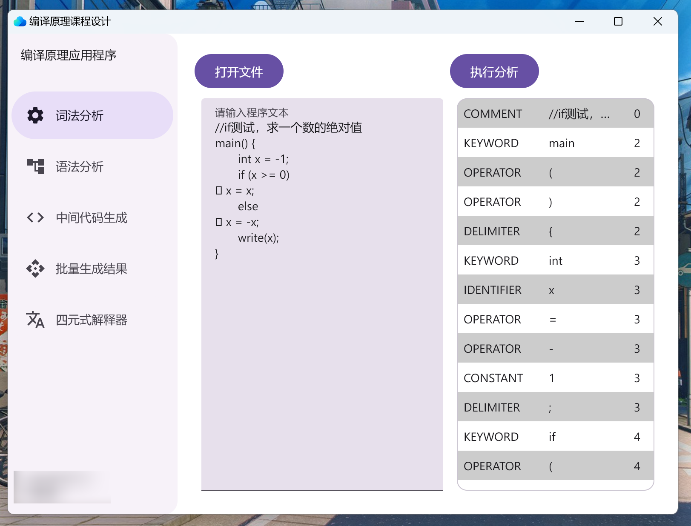
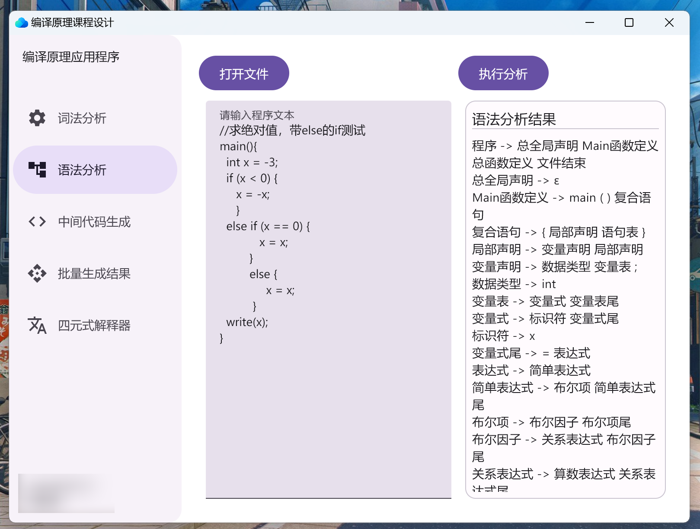
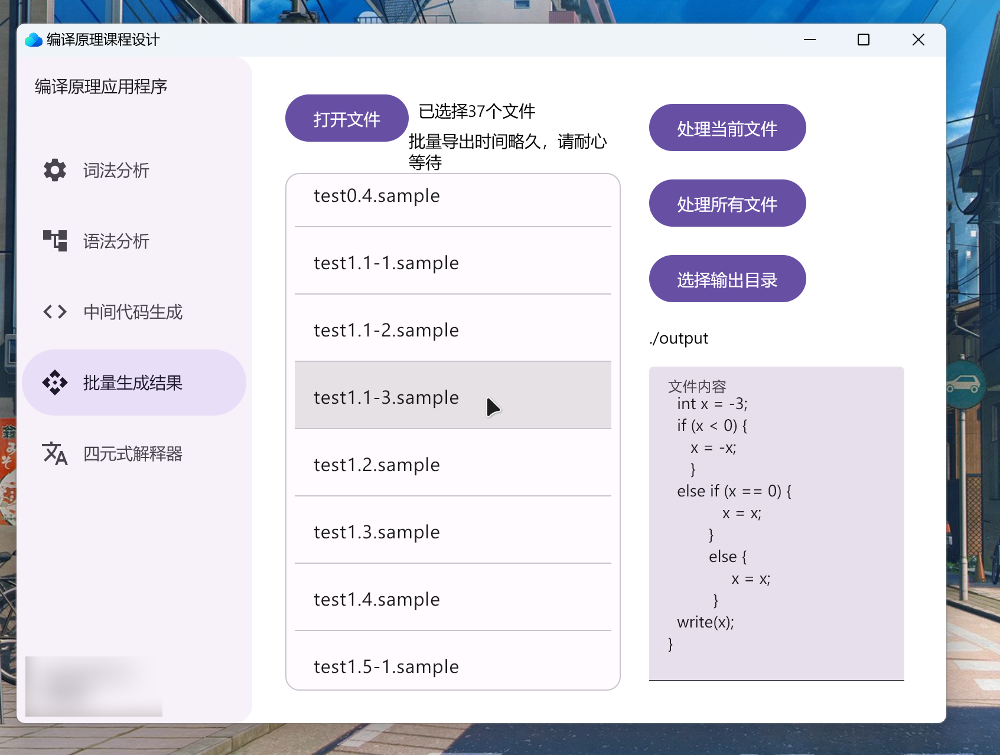
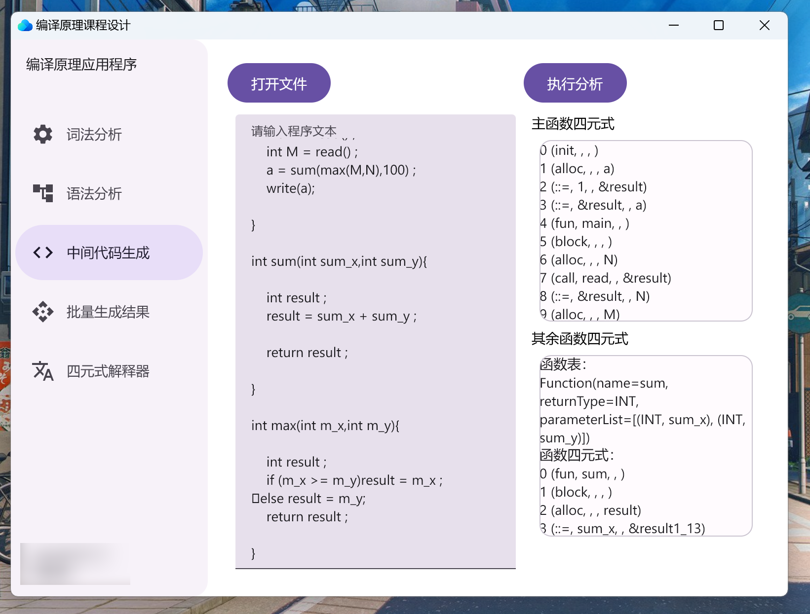
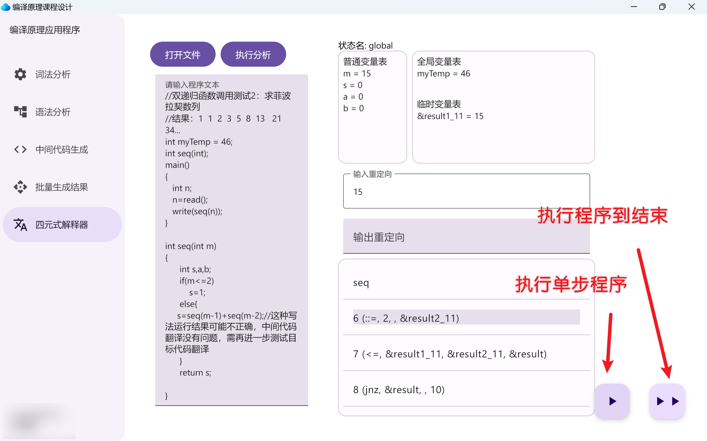

# 编译原理课程设计（GUI版）

## 如何运行

此项目适应Gradle构建，可以直接导入IDEA运行。

> [!CAUTION]
> 此项目的Java最低运行环境为Java17，与核心部分的Java8不同，如果想要自己写支持Java8的版本，请导入核心部分的项目然后自行编写。

如果依赖下载不下来，可以尝试修改并运行`build.gradle.kts`文件中的`maven`仓库地址。

先运行一遍`build.gradle.kts`文件，再尝试修改`maven`仓库地址。

最后在idea上运行`desktop`模块即可。

```kotlin
repositories {
    // 添加阿里云的maven仓库
    maven("https://maven.aliyun.com/repository/public")
}
```

## 核心部分

> [!Note]
> 关于编译器的核心部分可以看这个仓库：[编译原理课程设计](https://github.com/lanut/CompilationPrinciple)
> 
> 本仓库着重展示了编译器的GUI部分，包括词法分析、语法分析、语义分析、中间代码生成、中间代码解释器等部分。

可以运行测试案例5.1之前的案例。之后的函数多递归调用需要修改 return 的 bug，由于时间紧张的关系并未实现。

此外，break，continue语句的实现并未测试，需要自行测试。

## 词法分析


## 语法分析


## 批量生成结果


## 中间代码生成


## 中间代码解释器
